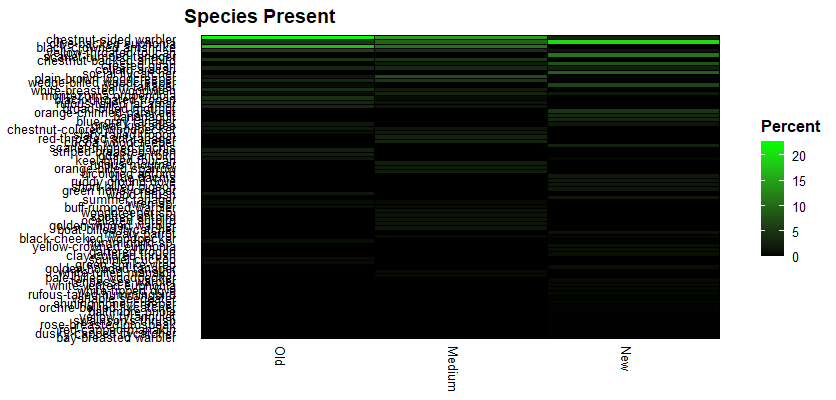
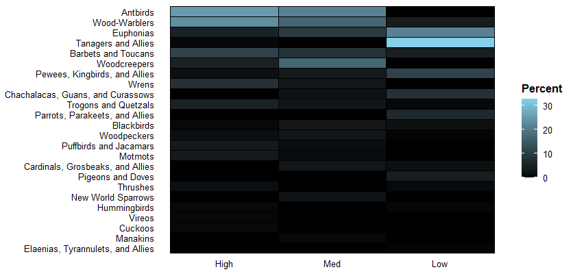

### November 28

#### Herboldt Heatmap Assignment

[script](Costa Rica Heatmaps.R)

*Instead of using data Madison provided, I used data I collected in Costa Rica for Tropical Ecology.*

My group collected data on mixed species flocks across 3 different-aged forests to compare flock composition across varying forest complexity.

Forest age (Old Growth, Secondary Growth, and Urban Areas) acted as a proxy for forest complexity (High, Medium, and Low, respectively)

We compared percent composition of a flock by species and I learned how to organize the x-axis in the way I wanted rather than alphabetically. I also organized the y-axis by higher percents present.

But that looks too crowded with too many species. 

So we organized it by family which looked much nicer as a heatmap:

Now we get a better idea of how similar (or dissimilar) our groups are!
