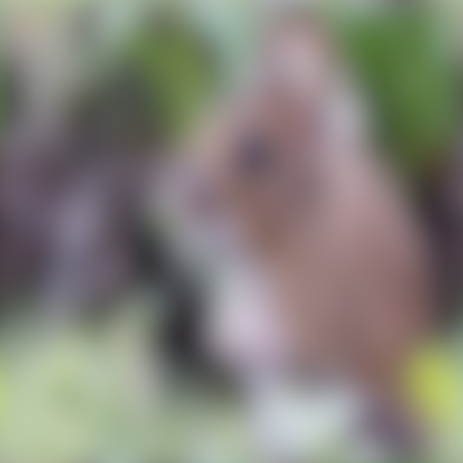

## 1. Barn owl

{width=20%}

{width=20%}

{width=20%}

## 2. Mallard

{width=20%}

{width=20%}

{width=20%}

## 3. Griffon

{width=20%}

{width=20%}

{width=20%}

## 4. Blue Jay

{width=20%}

{width=20%}

{width=20%}

## 5. Carolina Chickadee

{width=20%}

{width=20%}

{width=20%}

