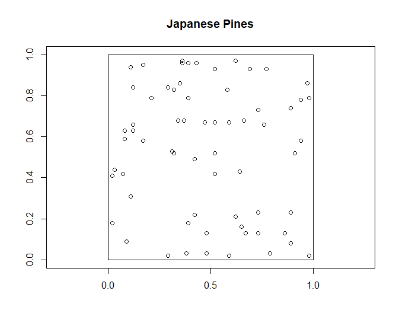
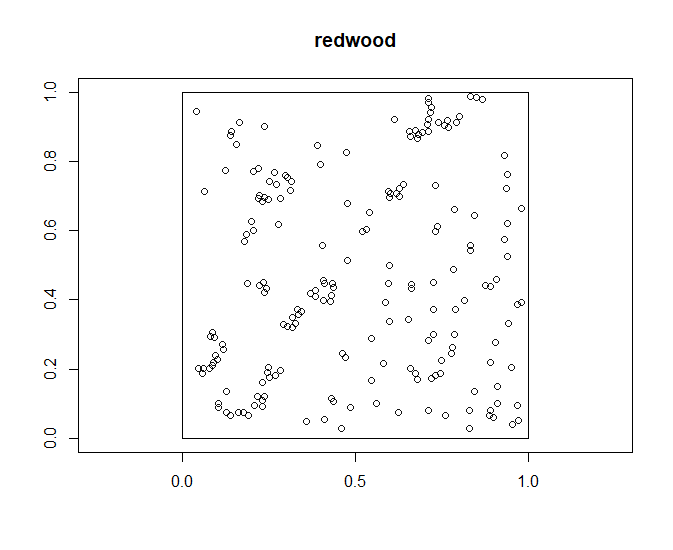
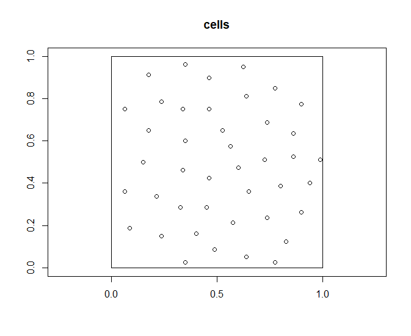

## **Analysis of Spatial Point Patterns**

##### With much help from [Use R: Applied Spatial Data Analysis with R](https://link.springer.com/book/10.1007/978-1-4614-7618-4) by Roger S. Bivand, Edzer Pebesma, Virgilio Gomez-Rubio

[whole script](Spatial Script 2.R) just in case

**Packages to Download**

```
install.packages("spatstat")
install.packages("maptools")
install.packages("lattice")

library(spatstat)
library(maptools)
library(lattice)

```

We will be using data on spatial distributions of Japanese Pine, Redwood saplings, and locations of cell centers.

```
data("japanesepines")
data("redwoodfull")
data("cells")

```
We can look at the plots for each of these basic point pattern data sets

```
plot(japanesepines, main = "Japanese Pines", axes = TRUE)
plot(redwoodfull, main = "redwood", axes = TRUE)
plot(cells, main = "cells", axes = TRUE)

```
{width=40%}, {width=40%} {width=40%}


These are point pattern data sets, or in `ppp` format:

"cartesian corrdinates of points in a two-dimensional plane"

we need the the points in a format that can be used by `SpatStat` 
We need to convert to `SpatialPoints`

```
spjpines <- as(japanesepines, "SpatialPoints")
spred <- as(redwoodfull, "SpatialPoints")
spcells <- as(cells, "SpatialPoints")

```
`SpatStat` returns data to its original scale

However, these are not directly comparable

```
plot(spjpines, main = "japanese pines", axes = TRUE)
plot(spred, main = "redwood", axes = TRUE)
plot(spcells, main = "cells", axes = TRUE)

summary(spjpines)#max of 5.7
summary(spred)#max of 1
summary(spcells)#max of 1

```
The Japanese pines have a max x axis of 5.7

Thankfully, we can use the `elide` method for standardizing `SpatialPoints` scales

Tests for Complete Spatial Randomness (CSR)