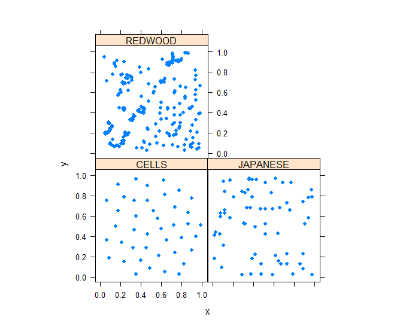
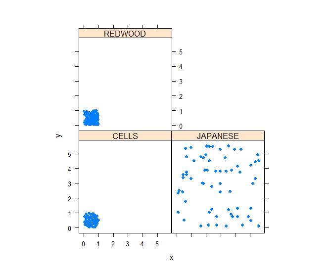
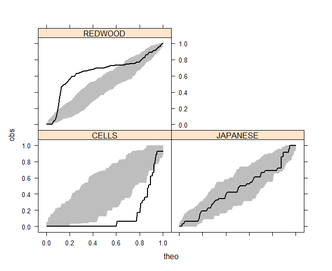
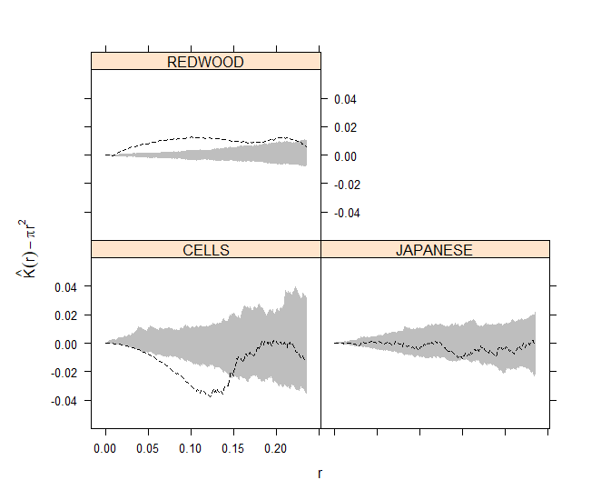

## **Analysis of Spatial Point Patterns**

##### With much help from [Use R: Applied Spatial Data Analysis with R](https://link.springer.com/book/10.1007/978-1-4614-7618-4) by Roger S. Bivand, Edzer Pebesma, Virgilio Gomez-Rubio

[whole script](Spatial Script 2.R) just in case

#### This is mainly to visualize and analyze spatial data to determine if it is uniform, clustered, or randomly spaced.

#### There's way more in-depth ways to analyze patterns in spatial and/or temporal data, but this is a way to begin to see if there is a pattern in spatial data at both large and small scales.

___

**Packages to Download**

```
install.packages("spatstat")
install.packages("maptools")
install.packages("lattice")

library(spatstat)
library(maptools)
library(lattice)

```

We will be using data on spatial distributions of Japanese Pine, Redwood saplings, and locations of cell centers.

```
data("japanesepines")
data("redwoodfull")
data("cells")

```
### **1. Standardizing and Visualizing Spatial Data** ###

We can look at the plots for each of these basic point pattern data sets

```
plot(japanesepines, main = "Japanese Pines", axes = TRUE)
plot(redwoodfull, main = "redwood", axes = TRUE)
plot(cells, main = "cells", axes = TRUE)

```
{width=40%}, {width=40%} {width=40%}


These are point pattern data sets, or in `ppp` format aka "cartesian corrdinates of points in a two-dimensional plane"

we need the the points in a format that can be used by `SpatStat` and can include more information about each point

We need to convert to `SpatialPoints`

```
spjpines <- as(japanesepines, "SpatialPoints")
spred <- as(redwoodfull, "SpatialPoints")
spcells <- as(cells, "SpatialPoints")

```
`SpatialPoints` returns data to its original scale

However, these are not directly comparable

```
plot(spjpines, main = "japanese pines", axes = TRUE)
plot(spred, main = "redwood", axes = TRUE)
plot(spcells, main = "cells", axes = TRUE)

summary(spjpines)#max of 5.7
summary(spred)#max of 1
summary(spcells)#max of 1

```
The Japanese pines have a max x axis of 5.7

Thankfully, we can use the `elide` method for standardizing `SpatialPoints` scales
```
spjpines1 <- elide(spjpines, scale=TRUE, unitsq=TRUE)
summary(spjpines1)#now the max = 1
```
Now we can set up a comparable data frame

```
dpp<-data.frame(rbind(coordinates(spjpines1),coordinates(spred), 
                      coordinates(spcells)))
print(dpp)
```
However, we need it to differentiate between the 3 different categories

```
njap<-nrow(coordinates(spjpines1))
nred<-nrow(coordinates(spred))
ncells<-nrow(coordinates(spcells))

dpp<-cbind(dpp,c(rep("JAPANESE",njap), rep("REDWOOD", nred), rep("CELLS", ncells))) 
names(dpp)<-c("x", "y", "DATASET")

print(dpp)
```
Now we can look at the standardized data as a whole

```
print(xyplot(y~x|DATASET, data=dpp, pch=19, aspect=1))
```
Correct standardized plots
{width=50%}

**if we didn't standardize the spacing of the Japanese pines,** 

*we would have gotten this*
{width=50%}

From the looks of it, redwood trees seem clustered in a few places, cells seem spaced evenly, and pines seem possibly random...

_____

### **2.Testing for Complete Spatial Randomness (CSR)** ###

**G function: Distance to the Nearest Event** 

compares an "envelope" of expected random distribution to the observed data (based on nearest neighbor distance)


Null hypothesis: Complete Spatial Randomness: 

$$G(r) = 1 - exp (-λπr^2)$$ 

λ = mean number of events per unit area (or intensity, which is important in other tests as well)

We will be using the functions `Gest` and `envelope`


```
r <- seq(0, sqrt(2)/6, by = 0.001)

envjap <- envelope(as(spjpines1, "ppp"), fun=Gest, r=r, nrank=2, nsim=99)

envred <- envelope(as(spred, "ppp"), fun=Gest, r=r, nrank=2, nsim=99)

envcells <- envelope(as(spcells, "ppp"), fun=Gest, r=r, nrank=2, nsim=99)
```
This created our theoretical random data for each set of observations

Time to combine it all:

```
Gresults <- rbind(envjap, envred, envcells) 
Gresults <- cbind(Gresults, 
                  y=rep(c("JAPANESE", "REDWOOD", "CELLS"), each=length(r)))
summary(Gresults)

```
And the plot:

```
print(xyplot(obs~theo|y, data=Gresults, type="l", 
             panel=function(x, y, subscripts)
             {
               lpolygon(c(x, rev(x)), 
                        c(Gresults$lo[subscripts], rev(Gresults$hi[subscripts])),
                        border="gray", col="gray"
               )
               
               llines(x, y, col="black", lwd=2)
             }
))

```


There are stats that go with these graphs, but

#### Redwoods show *clustered pattern* (values of G *above* the envelopes) ####

#### Cells shows a more *regular pattern* (values of G *below* the envelopes) ####

#### Japanese Pines seem to fit in the null envelope of Complete Spatial Randomness ####

_____
### **3. Second Order Properties** ###
Second-order properties measure the strength and type of the interactions between events of the point process

We want to measure strength and types of interactions between points

**K-function measures the number of events found up to a given distance of any particular event**


We will be using the `Kest` and `envelope` functions

```
Kenvjap<-envelope(as(spjpines1, "ppp"), fun=Kest, r=r, nrank=2, nsim=99) #we are still using the standardized pine plot(spjpines1)

Kenvred<-envelope(as(spred, "ppp"), fun=Kest, r=r, nrank=2, nsim=99)

Kenvcells<-envelope(as(spcells, "ppp"), fun=Kest, r=r, nrank=2, nsim=99)
```
Once again, R creates a random envelope range following the null of CSR

Time to combine: 

```
Kresults<-rbind(Kenvjap, Kenvred, Kenvcells)

Kresults<-cbind(Kresults, 
                y=rep(c("JAPANESE", "REDWOOD", "CELLS"), each=length(r)))
summary(Kresults)
```
And the plot of all 3: 

```
print(xyplot((obs-theo)~r|y, data=Kresults, type="l", 
             ylim= c(-.06, .06), ylab=expression(hat(K) (r)  - pi * r^2),
             panel=function(x, y, subscripts)
             {
               Ktheo<- Kresults$theo[subscripts]
               
               lpolygon(c(r, rev(r)), 
                        c(Kresults$lo[subscripts]-Ktheo, rev(Kresults$hi[subscripts]-Ktheo)),
                        border="gray", col="gray"
               )
               
               llines(r, Kresults$obs[subscripts]-Ktheo, lty=2, lwd=1.5, col="black")	
             }
))
```



#### Japanese Pines seem to follow CSR while redwood and cells do not ####