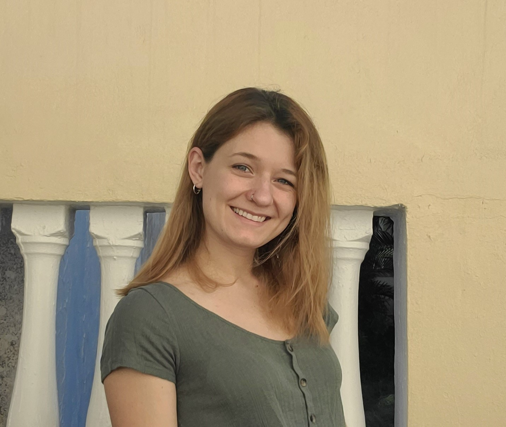

# **About Me**

{width=40%}

### **Educational Experiences**

Graduate Career: University of Tulsa
Molecular Biology Lab TA: 1 Semester

Undergraduate Career: University of Nebraska-Lincoln
Introduction to Biology Lab II TA: 5 semesters

### **Research Interests**

Cliff Swallows, of course

Reproductive Success of Cliff Swallows

[My Website](https://www.cliffswallow.org)

{width=50%}

[My Lesson](Pletcher Lesson/Spatial-Data-Lesson.html)

|date|Assignment|
|:-| :--:|
|Sept 1| [Assignment 1](Assignment1/assignment1.html)|
|Sept 8| [Assignment 2](Assignment2/Assignment2.html)|
|Sept 15| [Assignment 3](Assignment3/assignment3.html)|
|Sept 29| [Assignment 4](Assignment4/Assignment4_fix.html)|
|Sept 29| [Assignment 5](Assignment 5/Assignment-5.html) |
|Oct 11| [Assignment 6](Heatmaps/Tropical-Ecology-Script.html) |
|Oct 18| [Assignment 7](GIS_lesson/Assignment-7.html)|
|Oct 27| [Mierow Seminar Assignment](Mierow seminar assignment/Animal-Acuity.html)
|Nov 28| [Herrboldt Heatmaps Assignment](Heatmaps/Heatmap-Homework.html)

